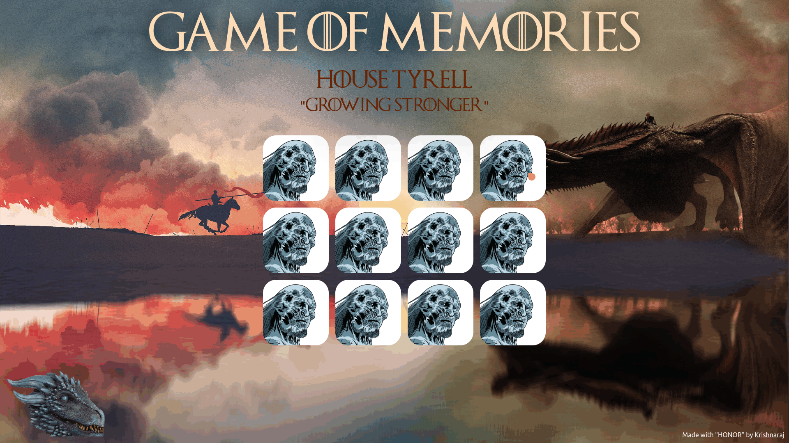

# Game-of-Memories
A simple Memory Game themed on Game of Thrones, written in HTML, CSS and JavaScript.

# Playing or Installation
1. Clone the Repository
2. Open the `index.html` file in your browser
3. Play the Game

# Screenshot

# GamePlay

# Credits
This is the first website I have made, thanks to tutorials from [The Free Code Camp.org](https://www.youtube.com/@freecodecamp) for the neverending help.
[This](https://www.youtube.com/watch?v=ec8vSKJuZTk&list=PLVzJm6SiAms8ghmF98T7bCiM7oAfA3uTW&index=13&t=5442s) video was referred. 